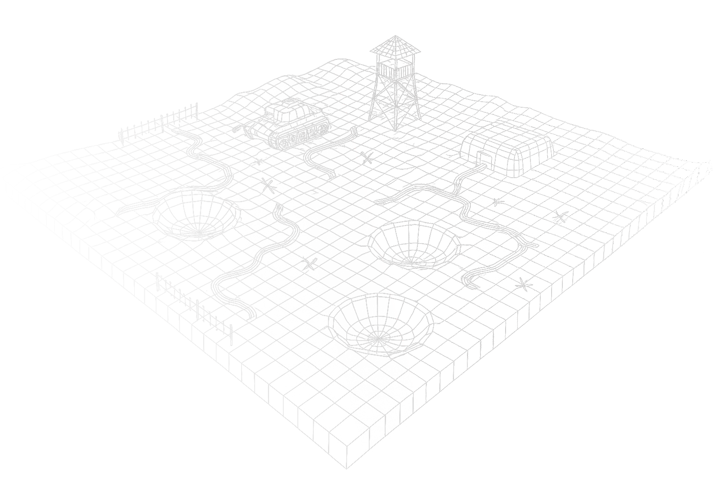
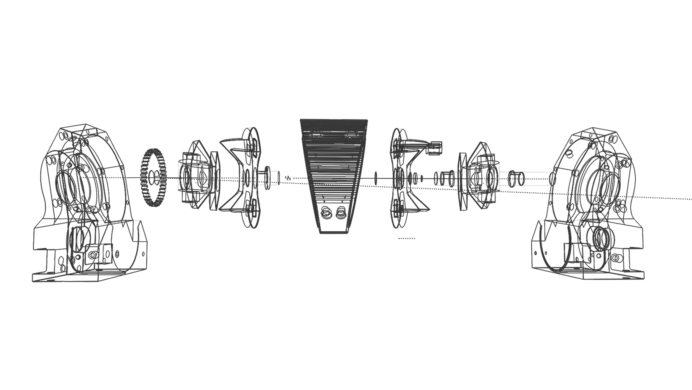

# Revolutionary Rotary Machine Technology

**A breakthrough rotary pumping mechanism delivering unprecedented efficiency as both compressor and internal combustion engine**

> **Compressor: Working Prototype** | **Engine: Design Phase**

---

## Core Innovation

A novel rotary pumping mechanism that eliminates the limitations of traditional piston and rotary designs.

### Key Numbers

| Metric | Value |
|--------|-------|
| Energy Savings | **30%** |
| Weight Reduction | **2-3x lighter** |
| Compressor Electricity Cost Share | **70-80%*** |
| Annual Savings per 100HP Unit | **$14K+** |

*\*Industry average according to U.S. Department of Energy studies*

*Proprietary Design - Patent Pending*

### Simplified Architecture

**60%+ fewer components** than piston engines. Results in **20%+ longer lifespan** and dramatically reduced maintenance costs.

### Double Power Cycles

Two-stroke equivalent delivers **2x power output** per rotation. Achieves **104 kW/L** vs 40-60 kW/L for piston engines.

### 30% Lower Energy Use

Reduced friction losses translate to **30% electricity savings**. For industrial compressors, this means **$14,000+/year** in reduced operating costs.

---

## Compressor Application

Working prototype demonstrating revolutionary performance improvements.

| Metric | Value |
|--------|-------|
| Electricity Savings | **30%** |
| Weight Reduction | **60%+** |
| Quieter Operation | **4x** |
| Lower Friction | **30%+** |
| Increased Durability | **20%+** |

### Massive Cost Reduction Potential

Electricity accounts for **70-80% of a compressor's lifetime operating cost**. Our 30% energy savings directly translates to dramatic cost reductions.

### **$14,400+/year**

*Potential savings per 100 HP industrial compressor unit*

| 10-Year Savings per Unit | Typical Annual Energy Cost* | ROI Timeline |
|:---:|:---:|:---:|
| **$144,000+** | **~$48,000** | **Months, Not Years** |

*\*Based on 100HP compressor operating at $0.10/kWh, 8,760 hours/year*

### Industry Applications

- **Military Vehicles** - HVAC systems and pneumatic equipment for armored vehicles requiring compact, reliable air supply
- **Aviation** - Pilot suit air supply systems where weight and reliability are critical factors
- **Naval Applications** - Diving air systems and compact installations for space-constrained marine environments
- **Rescue Equipment** - Portable pneumatic tools for emergency response requiring lightweight, reliable operation

---

## Engine Application

*Projected specifications based on design simulations for 1L displacement*

*Internal Architecture*

### Engine Comparison

| Specification | Traditional Piston | Rotary Machine |
|---|---|---|
| Mass per Liter | 65-80 kg/L | **30 kg/L** |
| Power Output | 40-60 kW/L | **104 kW/L** |
| Max RPM | 6,000-8,000 | **10,000+** |
| Noise Level | 85-95 dB | **<75 dB** |
| Vibration | High | **Minimal** |

### Target Industries

- **Defense Drones** - Combat and reconnaissance UAVs requiring high power-to-weight ratio and extended range
- **Armored Vehicles** - Tanks and APCs benefiting from compact, powerful engines with reduced thermal signature
- **Marine Vessels** - Cutters and patrol boats requiring quiet, efficient propulsion systems
- **Hybrid Powertrains** - Range extenders for electric vehicles combining efficiency with compact packaging

---

## Technical Specifications

Detailed comparison with conventional piston technology.

| Parameter | Piston Engine | Rotary Machine | Advantage |
|---|---|---|---|
| Chamber Diameter (1L) | ~80mm bore | 200mm | Simplified manufacturing |
| Displacement | 4x250cc cylinders | 4x250cc chambers | Equivalent capacity |
| Engine Mass | 65-80 kg/L | **30 kg/L** | **2-3x lighter** |
| Power Density | 40-60 kW/L | **104 kW/L** | **2x more powerful** |
| Operating Noise | 85-95 dB | **<75 dB** | **2-4x quieter** |
| Maximum RPM | 6,000-8,000 | **10,000+** | **30-50% higher** |
| Friction Losses | Baseline | **-30%** | **Higher efficiency** |
| Component Count | High (valvetrain, etc.) | **Minimal** | **Better reliability** |

---

## Benefits Summary

Comprehensive advantages across economic, environmental, and operational dimensions.

### Economic Benefits

- **30% electricity savings** - the biggest operating cost
- $14,000+/year savings per 100HP compressor unit
- Lower production costs due to simpler design
- Reduced maintenance requirements
- Extended service intervals
- Fewer spare parts needed

### Environmental Benefits

- **30% less energy consumption** = smaller carbon footprint
- Limited or eliminated oil usage
- Higher fuel efficiency
- Reduced emissions potential
- Smaller material footprint (60% lighter)

### Operational Benefits

- Significantly quieter operation
- Minimal vibration
- Higher reliability
- Easy scalability
- Extended operational lifespan

---

## Development Roadmap

| Phase | Status | Description |
|---|:---:|---|
| Concept Design | Completed | Initial concept and feasibility study completed |
| Compressor Prototype | Completed | Working prototype demonstrating core technology |
| Engine Design | **In Progress** | Detailed engineering and simulation phase |
| Engine Prototype | Planned | Build and test first engine prototype |
| Commercialization | Planned | Production partnerships and market entry |

---

## Contact

**Wojciech Sobczuk**
*Inventor & Project Lead*

- Phone: +48 601 226 614
- Email: wojtek@esvelo.com
